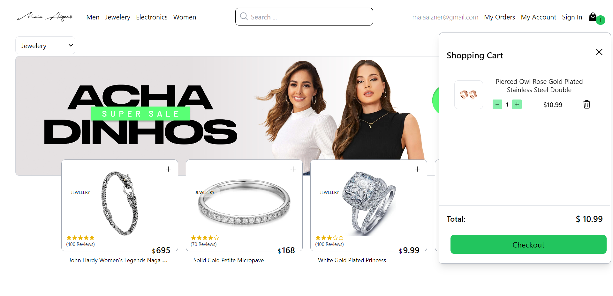

# MyEcommerce

MyEcommerce is a collaborative project aimed at helping developers learn the fundamentals of building an eCommerce application using React, Tailwind CSS, and Vite. This project emphasizes practical skills in front-end development, including product management, cart functionalities, and order handling. 

GO <a href="https://maiaaizner-ecommerce.netlify.app/" target="_blank">online version here ></a>

## Features

- **Product Management:** Easily browse and filter products.
- **Shopping Cart:** Add products to the cart and manage quantities.
- **Order Handling:** Place orders and view purchase history.
- **User Account Management:** Sign in and manage your account, with data persisted through localStorage for a seamless user experience.
- **User-Friendly Interface:** Enjoy a modern and functional user experience.
- **Collapsible and Draggable Sidebar:** Collapse the sidebar to focus on the main content and drag it to reposition according to your preference, providing a customizable user experience.

## Technologies Used

- **React:** For a dynamic and responsive user experience.
- **Tailwind CSS:** For a modern and flexible design.
- **localStorage:** For persisting user account and session data.
- **REST API:** For managing products and orders.

## Installation

To get started with MyEcommerce, follow these steps:

1. **Clone the Repository:**
   ```bash
   git clone https://github.com/maizner/MyEcommerce-react-vite-tailwind.git


2. **Navigate to the Project Directory:**
   ```bash
   cd MyEcommerce-react-vite-tailwind


3. **Install Dependencies:**
   ```bash
   npm install


4. **Start the Application:**
   ```bash
   npm start


## Credits and Acknowledgments
This project was developed based on the course <a href="https://platzi.com/home/clases/7396-react-vite-tailwindcss"> React + Tailwind c/ Vite</a>  Platzi. We give credit and thanks to Platzi and its instructor for providing the foundation of this project.


## Initial Project Documentation
This project was created with Vite and utilizes the Fake Store API to manage products and orders.
.

- **You can run the following scripts in the project directory:**
  ## Initial Project Documentation

This project was created with Vite and utilizes the Fake Store API to manage products and orders.

- **You can run the following scripts in the project directory:**
   ```bash
   npm run dev      # Runs the application in development mode.
   npm run build    # Builds the application for production in the build folder.
   npm run preview  # Previews the production build.


Check resources 
[Vite documentation](https://vitejs.dev/guide/)<br> or
[Fake Store Api documentation](https://fakestoreapi.com/) 
for more details.

## Contributions
If you would like to contribute to this project, feel free to fork the repository, create a new branch for your changes, and submit a pull request. Any contributions to improve the application are appreciated!

## Contact
For any questions or suggestions, you can contact the project author at maiaaizner@gmail.com.


